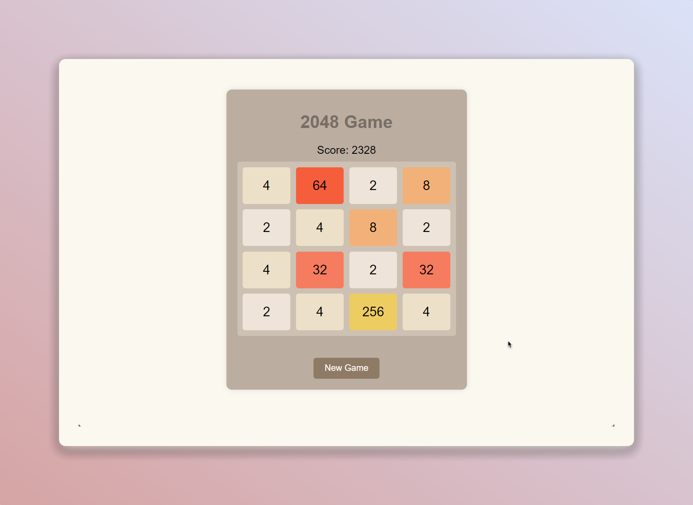

# 2048 Game 🎮



[](https://github.com/EXELVI/2048_game/stargazers)
[](https://github.com/EXELVI/2048_game)
[](https://github.com/EXELVI/2048_game/issues)
[](https://github.com/EXELVI/2048_game/commits/main)

## 📝 Description

The **2048 Game** is a simple and addictive sliding puzzle game where you merge tiles with the same number to create larger numbers, ultimately trying to reach the 2048 tile. The game is built with HTML, CSS, and JavaScript.

## 🚀 Features

- **Score Tracking**: Keep track of your progress with a dynamic score display.
- **Game Reset**: Start a new game at any time with the click of a button.
- **Keyboard Controls**: Play using the arrow keys on your keyboard.

## 🎮 How to Play

2. **Use the arrow keys** on your keyboard to move the tiles.
3. **Merge tiles** with the same number to create a larger number.
4. **Try to reach the 2048 tile** to win the game! The game ends when there are no more possible moves.

## 🌐 Live Demo

You can play the 2048 Game online at [exelvi.github.io/2048_game](https://exelvi.github.io/2048_game/).

## 🛠️ Installation

To play the 2048 Game on your local machine, follow these steps:

1. Clone the repository:
    ```bash
    git clone https://github.com/EXELVI/2048_game.git
    ```
2. Navigate to the project directory:
    ```bash
    cd 2048_game
    ```
3. Open `index.html` in your web browser to start playing!

## 🤝 Contributing

Contributions are welcome! If you have suggestions for improvements or new features, feel free to open an issue or submit a pull request.